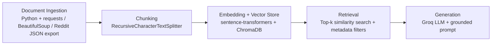

# Project 1 Planning: The Unofficial Guide

> Write this document before you write any pipeline code.
> Your spec and architecture diagram are what you'll use to direct AI tools (Claude, Copilot, etc.) to generate your implementation — the more specific they are, the more useful the generated code will be.
> Update the Retrieval Approach and Chunking Strategy sections if you change your approach during implementation.
> Update this file before starting any stretch features.

---

## Domain

Unofficial student knowledge about the Computer Science and Engineering path at Northern Virginia Community College (NOVA), especially transfer prep, course difficulty, professor/course comparisons, and workload advice. This domain is valuable because official catalogs describe requirements but do not capture the practical advice students need to choose between course options, sequence classes safely, or avoid common transfer mistakes.

---

## Documents

These sources cover course sequencing, transfer planning, physics/calculus choices, and programming course recommendations from student discussions and the NOVA wiki.

| # | Source | Description | URL or location |
|---|--------|-------------|-----------------|
| 1 | r/nvcc thread: CSC 221 course advice | Prep pathways, waivers, and external resources (Java MOOC, Professor Leonard) | https://www.reddit.com/r/nvcc/comments/xcujjw/please_advise_me_regarding_csc221_course/ |
| 2 | r/nvcc thread: CSC 223 conceptual discussion | Data Structures conceptual leap and transfer student reflections | https://www.reddit.com/r/nvcc/comments/1d3qzwx/csc_223/ |
| 3 | r/nvcc thread: CSC 223 summer-semester details | Exam formats, Zybooks reliance, and grading policies | https://www.reddit.com/r/nvcc/comments/1txt0tq/csc_223/ |
| 4 | r/nvcc thread: The Zybooks situation | Discussion on VCCS CSC 22X overhaul and Zybooks integration | https://www.reddit.com/r/nvcc/comments/ymwqzt/the_zybooks_situation/ |
| 5 | r/nvcc thread: Computer Science major question | Course alignment and elective vs core requirement clarifications | https://www.reddit.com/r/nvcc/comments/18jfmba/computer_science_major_question/ |
| 6 | r/nvcc thread: MTH 288 studying advice | Aggregated student strategies for Discrete Math mastery | https://www.reddit.com/r/nvcc/comments/syzpm2/discrete_math_mth_288_studying_advice/ |
| 7 | r/nvcc thread: EGR 122 evaluation | Engineering Design teaching models and CAD project expectations | https://www.reddit.com/r/nvcc/comments/qf9b29/egr_122/ |
| 8 | r/nvcc thread: PHYS 232 with Prof Medvar | University Physics II lab and exam practicalities | https://www.reddit.com/r/nvcc/comments/uzgmh7/phys_232_with_prof_medvar/ |
| 9 | r/nvcc thread: Transfer from A.S. Engineering to CS | Administrative steps and course-matching pitfalls | https://www.reddit.com/r/nvcc/comments/1t92mmm/transfer_from_as_engineering_to_cs_degree_at_va/ |
| 10 | NOVA wiki index | Community transfer wiki with automated credit-matching pipelines | https://www.reddit.com/r/nvcc/wiki/index/ |

---

## Chunking Strategy

**Chunk size:** 1200 characters

**Overlap:** 250 characters

**Reasoning:** Reddit threads are conversational and often depend on nearby context, so a fixed character splitter is too blunt by itself: it can cut a reply away from the parent sentence, a course code, or a professor name. A recursive character chunker is better because it tries to preserve natural boundaries first, but the target chunk size still needs to be small enough to keep each chunk focused on one topic and large enough to include the post header plus several replies.

For this corpus, 1200 characters is the best default because most useful Reddit comments are short but context-dependent. At that size, a chunk usually contains the parent post and at least one follow-up clarification without becoming so large that retrieval pulls in unrelated side conversations. A 250-character overlap helps keep pronouns, references to "that class" or "his professor," and follow-up advice connected across boundaries without creating too much duplicate noise in ChromaDB.

Recommended implementation note: use recursive character splitting with separators such as blank line, sentence boundary, newline, and space, then fall back to the 1200-character cap. That gives you the stability of fixed chunking with the context preservation of recursive splitting.

---

## Retrieval Approach

**Embedding model:** all-MiniLM-L6-v2 via sentence-transformers

**Top-k:** 5 chunks per query

**Production tradeoff reflection:** all-MiniLM-L6-v2 is a good local baseline because it is fast, small, and strong enough for short forum text. A lower top-k, such as 2 or 3, would often miss the reply that contains the actual answer or the parent post that defines the context. A higher top-k, such as 8 to 10, would increase recall but usually degrade the final response because the prompt fills with loosely related thread fragments, duplicate evidence, and contradictory advice from different students.

For this domain, top-k = 5 is the best balance. It usually gives the LLM one direct answer chunk, one parent-context chunk, and a few nearby alternatives or clarifications. That is enough context for grounded generation without overwhelming the model with noisy Reddit chatter.

If cost were not a constraint in production, the main tradeoffs for a stronger embedding model would be better semantic matching on messy conversational text, better handling of course abbreviations and paraphrases, and improved robustness to thread-local slang. I would weigh those gains against latency, memory footprint, local deployment simplicity, and whether the model can still run offline without adding operational complexity.

---

## Evaluation Plan

The questions below are designed to test whether retrieval can recover thread context, not whether the model can invent broad advice.

| # | Question | Expected answer |
|---|----------|-----------------|
| 1 | What do students say is the difference between CSC 205 and CSC 215? | CSC 215 is usually described as the more advanced option or the one with a different programming emphasis; the answer should mention the practical distinction rather than just repeating the catalog title. |
| 2 | What advice is given for transferring from NOVA CS to GMU? | The answer should mention transfer planning, keeping the sequence aligned with the target degree, and checking which CS/math/physics courses count cleanly toward the transfer path. |
| 3 | Which physics sequence do students recommend for engineering-oriented transfer, and when should each option be used? | The answer should distinguish between the easier/non-calculus path and the calculus-based options, and explain that the right choice depends on the student’s math readiness and transfer target. |
| 4 | What do students say about studying for MTH 288 discrete math? | The answer should mention that consistent practice, proof-style thinking, and early work on homework are recommended, rather than last-minute memorization. |
| 5 | Do the CS classes at NOVA use C, or do they use another language? | The answer should state that students discuss course language expectations rather than claiming all CS classes use one language; it should identify the language used in the relevant class discussion if present. |

---

## Anticipated Challenges

1. Reddit comments often depend on parent-post context, so a standalone comment can look meaningless or even contradictory if the chunk boundary removes the referenced class, professor, or transfer path. Mitigation: store parent title, parent body, thread URL, comment depth, and parent comment ID in metadata, and include the parent context text in the chunk before embedding.

2. Informal student advice mixes facts, opinions, and outdated course details, so retrieval can surface a confident but stale answer from an older thread. Mitigation: keep source timestamps in metadata, prefer chunks with explicit course codes and transfer terms, and add a lightweight ranking rule that boosts direct answers with matching course numbers while demoting vague conversational side remarks.

---

## Architecture

---

## AI Tool Plan

**Milestone 3 — Ingestion and chunking:** Use Copilot or Claude with this planning.md file plus the requirements.txt file. Give it the Domain, Documents, Chunking Strategy, and Anticipated Challenges sections, then ask it to implement document loading, Reddit thread parsing, metadata extraction, recursive chunking, and chunk preview logging. The expected output is Python code that turns each source into structured documents with parent/post/comment metadata. Verify by checking that chunks preserve thread context, that course codes are retained in chunk text or metadata, and that a sample thread produces reproducible chunk counts.

**Milestone 4 — Embedding and retrieval:** Give the AI the Chunking Strategy, Retrieval Approach, and Architecture sections, then ask it to implement ChromaDB persistence, embedding generation with all-MiniLM-L6-v2, top-k retrieval, and optional metadata filters. The expected output is a retrieval module that stores chunk text, source URL, parent IDs, timestamps, and course tags, then returns the five best matches for a query. Verify with test queries that retrieval returns the expected thread and that near-duplicate chunks do not dominate the results.

**Milestone 5 — Generation and interface:** Give the AI the Retrieval Approach plus the grounded generation requirements from the final project template, then ask it to build the prompt assembly logic and a simple local interface. The expected output is code that formats retrieved chunks with source labels, sends them to the local LLM, and refuses to answer when retrieval confidence is low. Verify by checking that responses cite sources, stay within the retrieved evidence, and do not invent course facts that are absent from the chunks.
